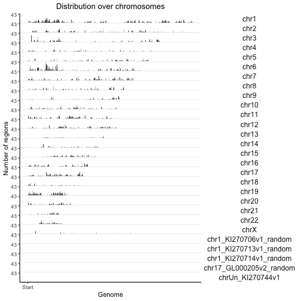
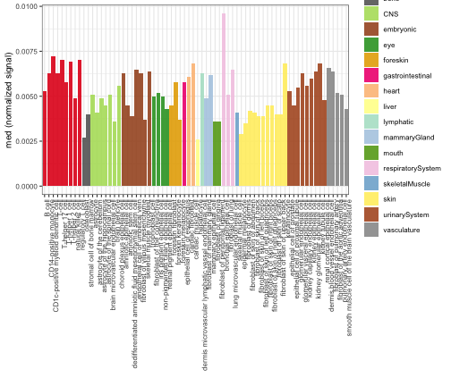

# Introduction

The point of this vignette is to demonstrate the seamless usage of out compation package: `GenomicDistributionsData` as a source of reference data sets that are not included in `GenomicDistributions`.

## Motivation

`GenomicDistributions` package comes with build-in reference data sets to perform calculations for human hg19 genome. 

To use `GenomicDistributions` with other reference genomes you need to install our companion package with more full-size data: `GenomicDistributionsData`. It's currently hosted on our server.


```r
install.packages("http://big.databio.org/GenomicDistributionsData/GenomicDistributionsData_0.0.1.tar.gz", repos=NULL)
```

## `GenomicDistributionsData` contents

This package provides the following data:


```r
library(GenomicDistributions)
library(GenomicDistributionsData)
datasetListIQR = utils::data(package="GenomicDistributionsData")
datasetList = datasetListIQR$results[,"Item"]
datasetList
```

```
##  [1] "TSS_hg19"              "TSS_hg38"              "TSS_mm10"             
##  [4] "TSS_mm9"               "cellTypeMetadata"      "chromSizes_hg19"      
##  [7] "chromSizes_hg38"       "chromSizes_mm10"       "chromSizes_mm9"       
## [10] "geneModels_hg19"       "geneModels_hg38"       "geneModels_mm10"      
## [13] "geneModels_mm9"        "openSignalMatrix_hg19" "openSignalMatrix_hg38"
```

# Usage

With the package loaded we have access to the required files for more genomes, namely:

* hg38
* hg19
* mm10
* mm9

Let's calculate some statistics and create plot for an hg38 BED file example. First, let's download one and read into R workspace:


```r
download.file(url="http://big.databio.org/GenomicDistributionsData/GSE91663_ENCFF319TPR_conservative_idr_thresholded_peaks_GRCh38.bed", destfile="example_hg38.bed")
query = rtracklayer::import("example_hg38.bed", extraCols=c(signalValue = "numeric", pValue = "numeric", qValue = "numeric", peak = "integer"))
```

```
## [1] TRUE
```


```r
# First, calculate the distribution:
x = calcChromBinsRef(query, "hg38")

# Then, plot the result:
plotChromBins(x)
```



The functions work with "hg38" as the reference. `GenomicDistributions` used required reference data sets from `GenomicDistributionsData` behind the scenes.

Importantly, using `GenomicDistributionsData` package you can perform calculations that were not possible before, since one of the inputs to `calcOpenSignal` function is a large matrix. Now, you just need to load in into the workspace, like this:


```r
data(openSignalMatrix_hg38)
op = calcOpenSignal(query, openSignalMatrix_hg38)
plotOpenSignal(op)
```


