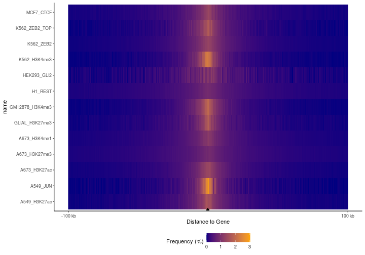
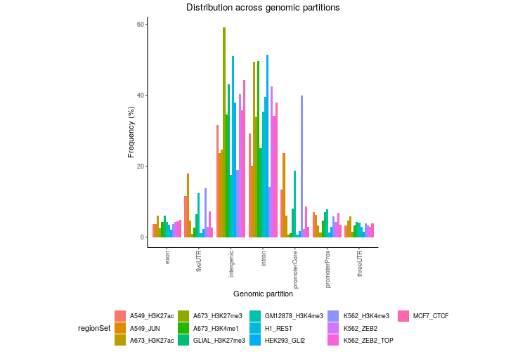
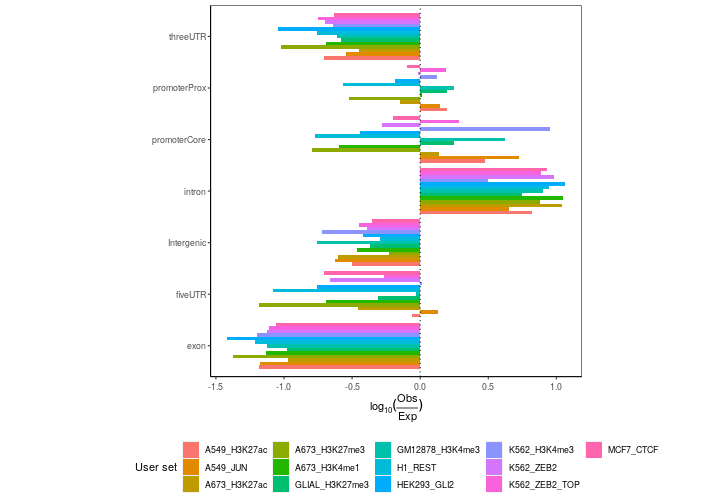
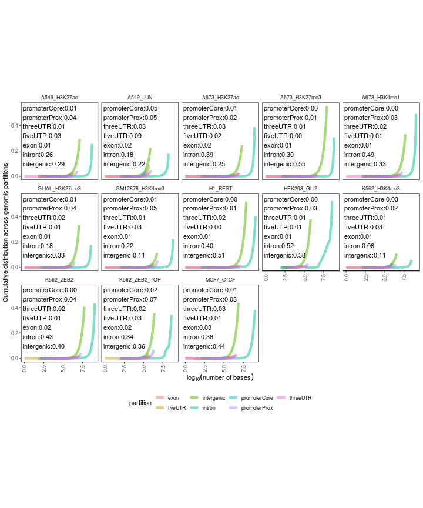
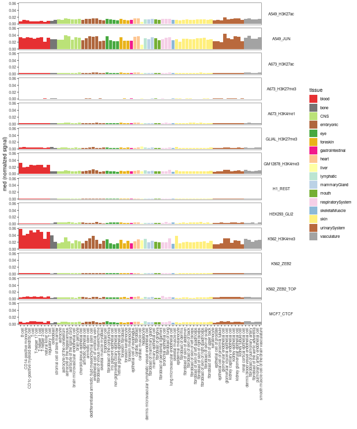
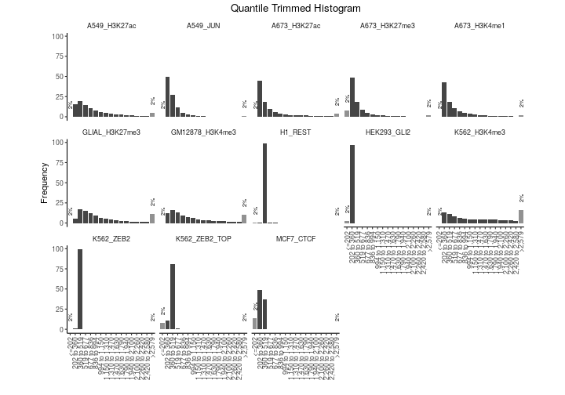

## Introduction

This vignette shows how to use GenomicDistributions of full-size data. It is pre-computed. Here's what you need to have installed:


```r
if (!requireNamespace("BiocManager", quietly = TRUE))
install.packages("BiocManager")
BiocManager::install("GenomicDistributions")
BiocManager::install("GenomicDistributionsData")
BiocManager::install("biomaRt")
```

Or alternatively you can install the latest version from GitHub: 


```r
devtools::install_github("databio/GenomicDistributions")
install.packages("http://big.databio.org/GenomicDistributionsData/GenomicDistributionsData_0.0.2.tar.gz", repos=NULL)
```
Here we'll load up the libraries needed for this vignette:


```r
library(biomaRt)
```

```
## Warning: package 'biomaRt' was built under R version 4.0.3
```

```r
library(ggplot2)
library(GenomeInfoDb)
library(GenomicDistributions)
library(GenomicDistributionsData)
```

## GenomicDistributionsData


This vignette demonstrates the seamless usage of our companion package: `GenomicDistributionsData` as a source of reference data sets that are not included in `GenomicDistributions`. The `GenomicDistributions` package comes with build-in reference data sets to perform calculations for human hg19 genome. To use `GenomicDistributions` with other reference genomes you need to install our companion package with more full-size data: `GenomicDistributionsData`. It's currently hosted on our server. This package provides the following data:


```r
datasetListIQR = utils::data(package="GenomicDistributionsData")
datasetList = datasetListIQR$results[,"Item"]
datasetList
```

```
##  [1] "TSS_hg19"              "TSS_hg38"              "TSS_mm10"              "TSS_mm9"               "cellTypeMetadata"     
##  [6] "chromSizes_hg19"       "chromSizes_hg38"       "chromSizes_mm10"       "chromSizes_mm9"        "geneModels_hg19"      
## [11] "geneModels_hg38"       "geneModels_mm10"       "geneModels_mm9"        "openSignalMatrix_hg19" "openSignalMatrix_hg38"
## [16] "openSignalMatrix_mm10"
```

With the package loaded we have access to the required files for more genomes, namely: `hg38`, `hg19`, `mm10`, `mm9`. In this vignette, we'll use "hg38", which will use reference data sets from `GenomicDistributionsData` behind the scenes. 

## Downloading files

Let's retrieve a variety of ENCODE BED files and use BiocFileCache to download them here:


```r
if (basename(getwd()) != "long_vignettes") setwd("long_vignettes")  # run from GenomicDistributions/long_vignettes
message(getwd())
bfc = BiocFileCache::BiocFileCache(getwd())
rpath = function(url, bfc) {
    # Utility function so we can lapply the data loading across a list.
    message("Downloading ", url)
    BiocFileCache::bfcrpath(bfc, url)
}

urls = c(
    H1_REST="https://ftp.ncbi.nlm.nih.gov/geo/series/GSE101nnn/GSE101251/suppl/GSE101251_ENCFF235EJG_peaks_GRCh38.bed.gz",
    MCF7_CTCF="https://ftp.ncbi.nlm.nih.gov/geo/series/GSE123nnn/GSE123219/suppl/GSE123219_ENCFF047HAG_conservative_idr_thresholded_peaks_GRCh38.bed.gz",
    K562_H3K4me3="https://ftp.ncbi.nlm.nih.gov/geo/series/GSE96nnn/GSE96303/suppl/GSE96303_ENCFF616DLO_replicated_peaks_GRCh38.bed.gz",
    GM12878_H3K4me3="https://ftp.ncbi.nlm.nih.gov/geo/series/GSE95nnn/GSE95899/suppl/GSE95899_ENCFF188SZS_replicated_peaks_GRCh38.bed.gz",
    K562_ZEB2="http://big.databio.org/example_data/bedbase_tutorial/bed_files/GSE91663_ENCFF316ASR_peaks_GRCh38.bed.gz", 
    HEK293_GLI2="http://big.databio.org/example_data/bedbase_tutorial/bed_files/GSE105977_ENCFF617QGK_optimal_idr_thresholded_peaks_GRCh38.bed.gz",
    K562_ZEB2_TOP="http://big.databio.org/example_data/bedbase_tutorial/bed_files/GSE91663_ENCFF319TPR_conservative_idr_thresholded_peaks_GRCh38.bed.gz",
    GLIAL_H3K27me3="https://ftp.ncbi.nlm.nih.gov/geo/series/GSE95nnn/GSE95927/suppl/GSE95927_ENCFF724DGK_replicated_peaks_GRCh38.bed.gz",
    A673_H3K27me3="https://ftp.ncbi.nlm.nih.gov/geo/series/GSE96nnn/GSE96349/suppl/GSE96349_ENCFF412EXZ_peaks_GRCh38.bed.gz",
    A673_H3K27ac="https://ftp.ncbi.nlm.nih.gov/geo/series/GSE96nnn/GSE96332/suppl/GSE96332_ENCFF529ISR_peaks_GRCh38.bed.gz",
    A673_H3K4me1="https://ftp.ncbi.nlm.nih.gov/geo/series/GSE96nnn/GSE96216/suppl/GSE96216_ENCFF328DBS_peaks_GRCh38.bed.gz",
    A549_JUN="https://ftp.ncbi.nlm.nih.gov/geo/samples/GSM2437nnn/GSM2437721/suppl/GSM2437721_ENCFF064QGH_peaks_GRCh38.bed.gz",
    A549_H3K27ac="https://ftp.ncbi.nlm.nih.gov/geo/samples/GSM2421nnn/GSM2421593/suppl/GSM2421593_ENCFF715EXP_peaks_GRCh38.bed.gz")
bedpaths = lapply(urls, rpath, bfc)
```

Read these files in and build a GenomicRanges object:


```r
df = lapply(bedpaths, data.table::fread)
gr1 = GenomicDistributions::dtToGr(df[[1]], chr="V1", start="V2", end="V3")
grs = lapply(df, GenomicDistributions::dtToGr, chr="V1", start="V2", end="V3")
grs = lapply(grs, sort)
queryList = GRangesList(grs)
```

## Distance distribution plots

First let's look at the distance to TSS:


```r
TSSdist = calcFeatureDistRefTSS(queryList, "hg38")
p = plotFeatureDist(TSSdist, featureName="TSS", tile=TRUE, nbin=200)
print(p)
```


Here, we're using a built-in dataset of protein-coding TSSs for hg38. You can see clear differences here; the JUN TF dataset is the most concentrated around TSSs, followed by the H3K4me3 experiments, which makes sense because that's a promoter mark. Enhancer marks H3K27ac and H3K4me1 are more diffuse, with the repressive mark H3K27me3 being the most diffuse of all of them. This plot makes it easy to visualize these differences for lots of files all at once. -- but we're too zoomed out with the default settings, since almost everything is happening right around the TSSs. So, let's zoom in now and look at 10 kb surrounding the TSS and let's order the datasets based on the values in bins surrounding TSSs.


```r
p2 = plotFeatureDist(TSSdist, featureName="TSS", tile=TRUE, size=1e4, nbin=200, labelOrder = "center")
print(p2)
```


Now we can see much more clearly what's happening around the TSS. Notice how the TF, JUN, is right at the TSS, while the promoter-associated histone marks show the nucleosome-depleted region centered at the TSS.  The H3K4me1 mark is broader than the H3K27ac experiments. Also, the repressive marks still show that broad spread.


Let's see what happens when we calculate distances to *genes*, instead of to *TSSs*. The difference is now our feature data will be the full gene body rather than just a 1 nucleotide at the start site.:


```r
library(EnsDb.Hsapiens.v86)
```

```
## Warning: package 'ensembldb' was built under R version 4.0.5
```

```
## Warning: package 'GenomicFeatures' was built under R version 4.0.4
```

```
## Warning: package 'AnnotationDbi' was built under R version 4.0.3
```

```
## Warning: package 'Biobase' was built under R version 4.0.3
```

```
## Warning: package 'AnnotationFilter' was built under R version 4.0.3
```

```r
annoData = ensembldb::genes(EnsDb.Hsapiens.v86)
seqlevels(annoData) = paste0("chr", seqlevels(annoData)) # Change from ensembl-style chrom annotation to UCSC_style
TSSdist = calcFeatureDist(queryList, annoData)
p = plotFeatureDist(TSSdist, featureName="Gene", tile=TRUE, nbin=200)
print(p)
```



Here you can tell that we've lost the resolution around the TSS, which makes sense because we're no longer looking at distance to the TSS, but to the entire gene body. For reference, you could reproduce the TSS plots by converting these genes to just 1 base, like this: `annoDataP=promoters(annoData, 1, 1)`. But we see similar trends as before. These plots are really useful comparisons to see how different types of regions distribute around other features.

## Partition plots

Next, let's see how these are distributed across genomic partitions.


```r
perc2 = calcPartitionsRef(queryList, "hg38")
plotPartitions(perc2)
```



In this plot regions are classified based on overlaps with annotation classes that are given priority. Once an overlap is found between a query region and an annotation class of high priority, it is not tested for overlaps with annotation classes with lower priorities. In `calcPartitionsRef` function annotation classes are sorted from highest to lowest priority in following order: core promoter, proximal promoter, 3’untranslated region (3’UTR), 5’UTR, exon, intron and regions not falling into any of these are classified as intergenic. If you are more interested in proportional overlap, i.e. what percentage of bp from your region sets falls into each annotation class, you can just set the `bpProportion=TRUE`. Let's have a look.


```r
propPerc = calcPartitionsRef(queryList, "hg38", bpProportion=TRUE)
plotPartitions(propPerc)
```


### Add custom partitions

You can also include custom partitions too! First, we'll grab all of the Ensembl predicted enhancers from the ensembl regulatory build.


```r
funcgen = biomaRt::useMart("ENSEMBL_MART_FUNCGEN")
funcgen = biomaRt::useDataset("hsapiens_regulatory_feature", mart=funcgen)

enhancers = biomaRt::getBM(attributes=c('chromosome_name', 'chromosome_start', 
                               'chromosome_end', 'feature_type_name'), 
                  filters='regulatory_feature_type_name', 
                  values='Enhancer', 
                  mart=funcgen)
```

Then we'll convert chromosome names to the UCSC naming convention to match included partitions. Next, follow that up by converting this into a GenomicRanges object.

```r
enhancers$chromosome_name = paste("chr", enhancers$chromosome_name, sep="")

gr1 = GenomicRanges::sort(GenomeInfoDb::sortSeqlevels(
    GenomicDistributions::dtToGr(enhancers,
                                 chr="chromosome_name",
                                 start="chromosome_start",
                                 end="chromosome_end")))
```

Now we can add our enhancers GenomicRanges object to the list of partitions we can obtain from the GenomicDistributions package itself.

```r
geneModels = GenomicDistributions::getGeneModels("hg38")
partitionList = GenomicDistributions::genomePartitionList(geneModels$genesGR, 
                                                          geneModels$exonsGR,
                                                          geneModels$threeUTRGR, 
                                                          geneModels$fiveUTRGR)
partitionList[["enhancer"]] = gr1
```

And how does this look now that we've included enhancers?


```r
perc3 = calcPartitions(queryList, partitionList)
plotPartitions(perc3)
```


Both plots show some variation among the files, and that most stuff is in introns or intergenic...but this plot really isn't that useful because it's not corrected for the genomic background. It's not surprising that most regions in a file are intergenic -- because most of the genome is intergenic. So, we're much better off looking at the *expected* partition plot, which uses a log ratio of observed versus background expectation:


```r
ep2 = calcExpectedPartitionsRef(queryList, "hg38")
plotExpectedPartitions(ep2)
```



Now we can start to draw some conclusions. We see lots of differences in promoters, which make biological sense. We see that H3K4me3 marks and JUN transcription factor are especially highly enriched in core promoter compared to the rest of the datasets. This makes biological sense since H3K4me3 is a well-known for its association with promoter regions and transcription factors bind promoter regions. On the other hand, the repressive marks like H3K27me3 associated with heterochromatin show considerably lower enrichment in the promoter regions.

Furthermore, we can do the same thing with the expected plots that we could with the frequency plots and include the enhancer annotation class. The function for calculation of expected partition distribution with user provided annotation classes, however, requires additional input compared to the wrapper `calcExpectedPartitionsRef` function. This is simply a sum of chromosome sizes for a given organism. Let’s also see, how do these results turn out when looking at proportional overlaps.


```r
chromSizes = getChromSizes('hg38')
genomeSize = sum(chromSizes)
ep3 = calcExpectedPartitions(queryList, partitionList, genomeSize, bpProportion=TRUE)
plotExpectedPartitions(ep3)
```


From this plot we can see that H3K27ac and H3K4me1, marks known for their association with enhancers, are in fact enriched in enhancer regions, unlike the rest of the datasets.

Next, we'll plot the cumulative partition plots:


```r
cp2 = calcCumulativePartitionsRef(queryList, "hg38")
p = plotCumulativePartitions(cp2)
p + facet_wrap(. ~name, nrow=3)
```



In these plots th y-axis indicates how much is a region set enriched in a given partition and the x-axis brings an additional information about the overall coverage of the partitions by the region set.

Again, we can also plot these with the enhancers included.


```r
cp3 = calcCumulativePartitions(queryList, partitionList)
p = plotCumulativePartitions(cp3)
p + facet_wrap(. ~name, nrow=3)
```


## Chromosome plots

Here we can see if any of the files have a strange distribution across chromosomes:


```r
chromBins = calcChromBinsRef(queryList, "hg38")
# Then, plot the result:
plotChromBins(chromBins[!grepl("_", chr, fixed=TRUE),])
```

```
## Warning: Removed 3890 rows containing missing values (geom_bar).
```


## Signal in regions - open chromatin signal specificity

Next, we'll explore the chromatin accessibility by cell type. Using the `calcSummarySignal` function requires an open signal matrix that is included with `GenomicDistributionsData`. The matrices are available for hg19 (openSignalMatrix_hg19), hg38 (openSignalMatrix_hg38) and mm10 (openSignalMatrix_mm10). We further include metadata for these matrices in `GenomicDistributions` that assign cell type to the tissue of origin for coloring purposes (inlcuding metadata for plotting is optional). Now, you just need to load in into the workspace, like this:


```r
library(GenomicDistributionsData)
openSignalMatrix_hg38 = openSignalMatrix_hg38()
op = calcSummarySignal(queryList, openSignalMatrix_hg38)
# get cell type metadata from GenomicDistributions
cellTypeMetadata = cellTypeMetadata
opp = plotSummarySignal(op, metadata = cellTypeMetadata, colorColumn = "tissueType")
opp
```



As expected, the active marks have greater overall signal. We also see some specificity, with regions derived from blood cells showing more openness in blood cell types.

This type of plot is not restricted to open chromatin signal from different cell types. You can plot any kind of signal from different conditions, as long as you provide your own signal matrix to the `calcSummarySignal` function.

# Neighbor distance

Next we can calculate the distribution distances between two consecutive regions in a sorted region set. 


```r
# This needs to be corrected for number of regions.
nd = calcNeighborDist(queryList)

# Plot the distribution
plotNeighborDist(nd)
```


Here we can see that certain region sets have a very distinct signature in neighbor distance distribution. Some of the distributions are bimodal, that suggests a pattern in which groups of regions form local clusters and that the distances between individual clusters are longer. 

## Width distribution

The width distribution plot shows us how wide our regions are:


```r
qt2 = calcWidth(queryList)
p = plotQTHist(qt2, bins=15)
p + facet_wrap(. ~name, nrow=3)
```



He we can see that a few of the experiments seem to be almost entirely the same width; the REST dataset, for example. This may indicate that these files were computationally set to be uniform width. We also see differences in the width distributions of others. The histone marks are wider than the TFs, which makes sense. We also notice that the two H3K4me3 experiments have different distributions, with the K562 experiment trending toward wider regions. This could reflect different methods of peak calling for these datasets.

## GC content

You can further find out what is the GC content in your regions of interest.


```r
gc = calcGCContentRef(queryList, "hg38")
plotGCContent(gc)
```


As you can see, as part of the plotting function, we also included a line indicating mean GC content for a given region set to make the comparison among the region sets easier.

## Dinucleotide frequencies

And finally, you can calculate 


```r
df = calcDinuclFreqRef(queryList, "hg38")
plotDinuclFreq(df)
```


That wraps it up! I hope this vignette convinces you that GenomicDistributions can calculate and plot some interesting data to compare genomic region sets.
